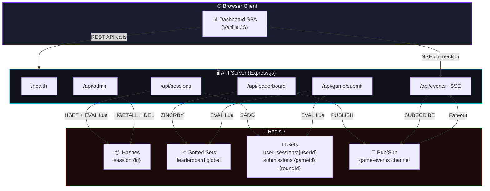
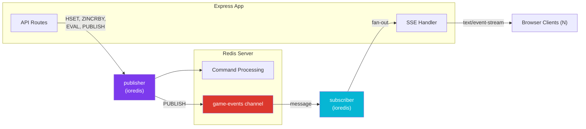
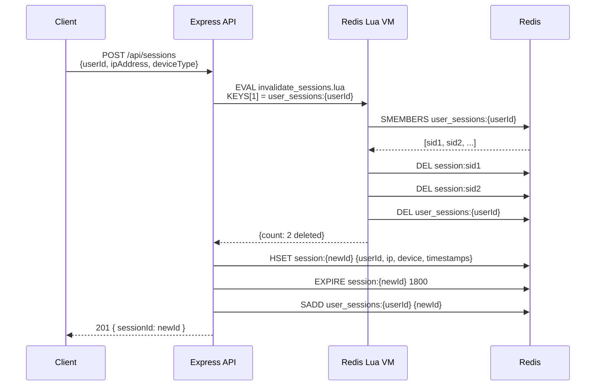
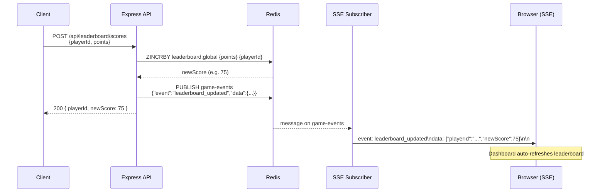
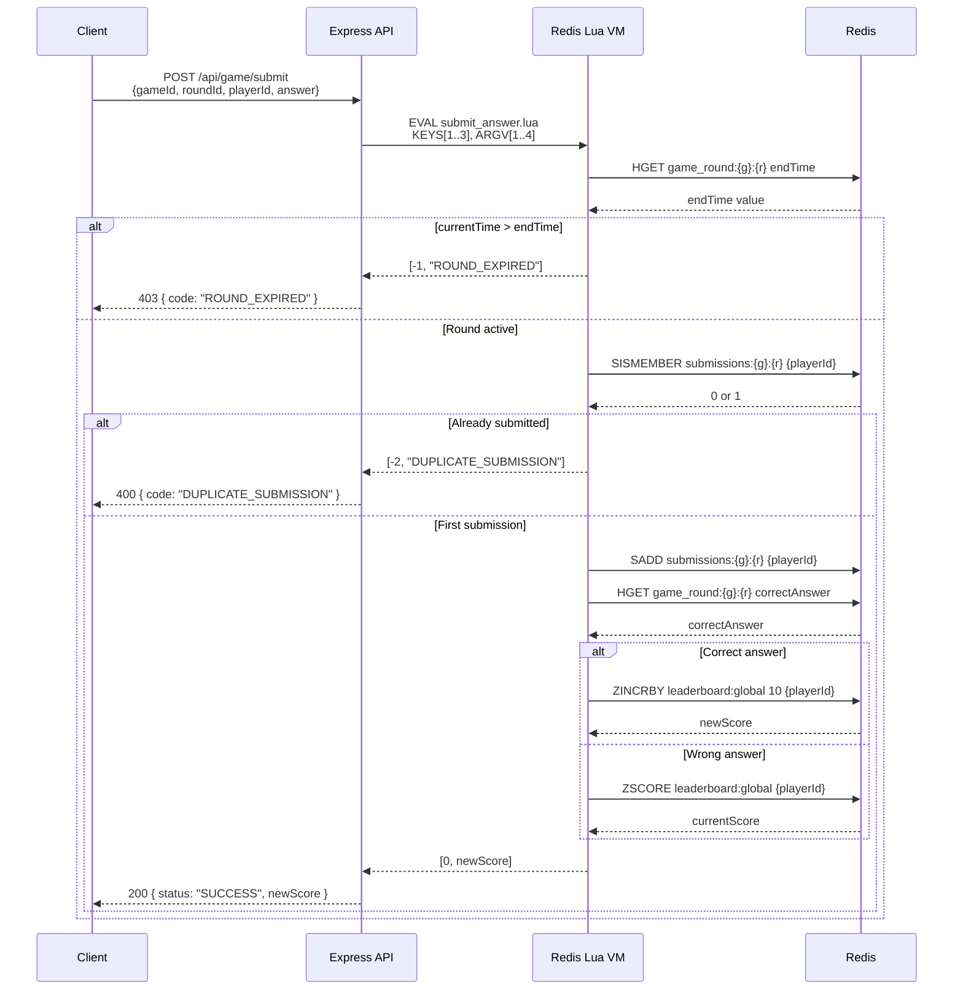
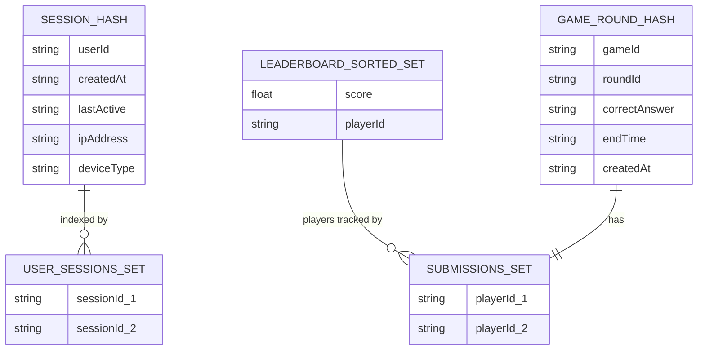
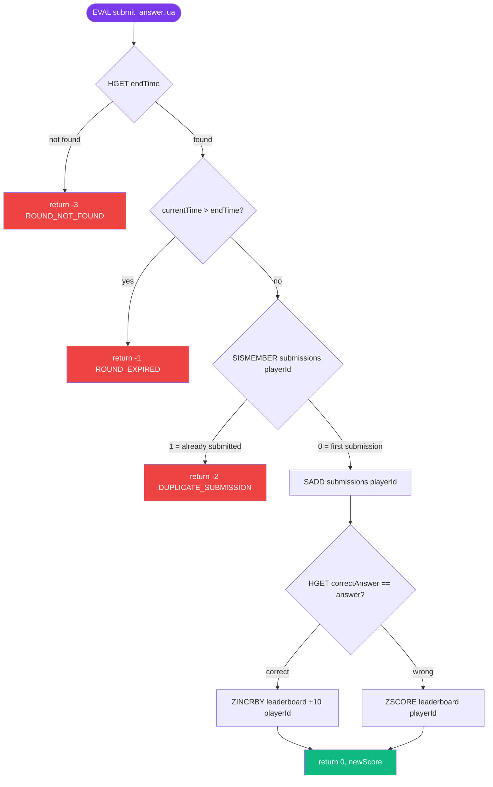
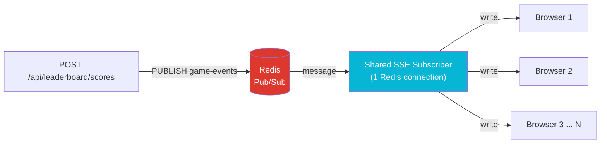

<div align="center">


<br/>

[](https://redis.io)
[](https://nodejs.org)
[](https://expressjs.com)
[](https://docker.com)
[](LICENSE)

<br/>

> **A high-performance, production-ready backend for a real-time competitive quiz game.**  
> Powered by advanced Redis data structures, atomic Lua scripts, and live Server-Sent Events.

<br/>

[🚀 Quick Start](#-quick-start) · [📐 Architecture](#-system-architecture) · [📡 API Reference](#-api-reference) · [🔬 Lua Scripts](#-lua-scripts--atomicity) · [🧪 Testing](#-testing--verification)

---

</div>

## 📋 Table of Contents

- [✨ Project Overview](#-project-overview)
- [🛠 Tech Stack](#-tech-stack)
- [📁 Folder Structure](#-folder-structure)
- [📐 System Architecture](#-system-architecture)
- [🔄 Execution Flow](#-execution-flow)
- [🗃️ Redis Key Schema](#️-redis-key-schema)
- [🚀 Quick Start](#-quick-start)
- [⚙️ Configuration](#️-configuration)
- [📡 API Reference](#-api-reference)
- [🔬 Lua Scripts & Atomicity](#-lua-scripts--atomicity)
- [📡 Real-Time Events (SSE)](#-real-time-events-sse)
- [🎮 Frontend Dashboard](#-frontend-dashboard)
- [🧪 Testing & Verification](#-testing--verification)
- [📊 Memory Analysis](#-memory-analysis)

---

## ✨ Project Overview

**QuizArena** is a backend infrastructure for a competitive, real-time quiz game platform. It demonstrates how Redis — far beyond a simple cache — can serve as a powerful, low-latency data structure server for gaming applications.

<div align="center">

| Feature | Implementation |
|---|---|
| 🏆 **Real-Time Leaderboard** | Redis Sorted Sets (ZINCRBY, ZREVRANGE) |
| 🔐 **Session Management** | Redis Hashes with sliding 30-min TTL |
| ⚡ **Atomic Game Logic** | Lua scripts via EVAL |
| 📡 **Live Score Updates** | Redis Pub/Sub → Server-Sent Events |
| 🛡️ **Race Condition Safety** | Lua atomicity eliminates all TOCTOU bugs |
| 🐳 **One-Command Deploy** | Docker Compose |

</div>

---

## 🛠 Tech Stack

<div align="center">

| Layer | Technology | Purpose |
|---|---|---|
| **Runtime** | Node.js 20 LTS | Async I/O, excellent Redis ecosystem |
| **Framework** | Express.js 4.x | REST API + SSE endpoints |
| **Redis Client** | ioredis 5.x | Pipelines, Lua EVAL, Pub/Sub |
| **Database** | Redis 7 (Alpine) | In-memory data structures |
| **Containerization** | Docker + Compose | Reproducible single-command environment |
| **Frontend** | Vanilla HTML/CSS/JS | Zero-dependency live dashboard |
| **ID Generation** | uuid v4 | Cryptographically random session IDs |

</div>

### Why Redis over a Relational DB?

```
Relational DB query path:
  Client → Network → DB Server → Disk I/O → Parse SQL → Lock rows → Return → Network
  Typical latency: 5–50ms per query

Redis operation path:
  Client → Network → In-memory data structure → Return
  Typical latency: 0.1–1ms per operation
```

For a leaderboard with 1M players, `ZREVRANK` runs in **O(log N)** — roughly 20 comparisons — regardless of data size.

---

## 📁 Folder Structure

```
AtomicRank/
│
├── 📄 docker-compose.yml          # Orchestrates api + redis services
├── 📄 Dockerfile                  # Multi-stage Node.js 20 Alpine build
├── 📄 .env.example                # Environment variable template
├── 📄 .gitignore                  # Excludes .env, node_modules
├── 📄 package.json                # Dependencies and scripts
├── 📄 submission.json             # Evaluator configuration
├── 📄 MEMORY_ANALYSIS.md          # Redis memory encoding analysis
├── 📄 README.md                   # This file
├── 📄 architecture.md             # System architecture documentation
├── 📄 projectdocumentation.md     # Full project documentation
│
├── 📂 src/
│   ├── 📄 index.js                # Express app entry point + /health
│   │
│   ├── 📂 config/
│   │   └── 📄 redis.js            # Publisher + Subscriber Redis clients
│   │
│   ├── 📂 routes/
│   │   ├── 📄 sessions.js         # POST /api/sessions
│   │   ├── 📄 leaderboard.js      # Score submission + leaderboard queries
│   │   ├── 📄 game.js             # POST /api/game/submit (Lua)
│   │   ├── 📄 events.js           # GET /api/events (SSE)
│   │   └── 📄 admin.js            # Admin session management
│   │
│   ├── 📂 scripts/
│   │   ├── 📄 invalidate_sessions.lua   # Atomic session cleanup
│   │   └── 📄 submit_answer.lua         # Atomic game answer processing
│   │
│   ├── 📂 middleware/
│   │   └── 📄 errorHandler.js     # Centralised error handling
│   │
│   └── 📄 seed.js                 # Data seeding utility
│
└── 📂 public/
    ├── 📄 index.html              # Dashboard SPA entry point
    ├── 📄 style.css               # Dark glassmorphism design system
    └── 📄 app.js                  # Frontend application logic
```

---

## 📐 System Architecture

### High-Level Overview



### Two-Connection Redis Pattern



> **Why two connections?**  
> Once `SUBSCRIBE` is called on an ioredis connection, it enters dedicated Pub/Sub mode and cannot process regular commands. The `publisher` handles all read/write commands; the `subscriber` handles all incoming Pub/Sub messages.

---

## 🔄 Execution Flow

### Session Creation Flow



### Score Submission & Live Update Flow



### Atomic Game Answer Flow



---

## 🗃️ Redis Key Schema



| Key Pattern | Redis Type | TTL | Description |
|---|---|---|---|
| `session:{sessionId}` | Hash | 1800s | Per-session data |
| `user_sessions:{userId}` | Set | None | Index of active sessions |
| `leaderboard:global` | Sorted Set | None | All player scores |
| `leaderboard:game:{gameId}` | Sorted Set | None | Per-game scores |
| `game_round:{gameId}:{roundId}` | Hash | 3600s after end | Round metadata |
| `submissions:{gameId}:{roundId}` | Set | Inherits | Submitted player IDs |

---

## 🚀 Quick Start

### Prerequisites

- Docker ≥ 24.x
- Docker Compose ≥ 2.x

### 1. Clone the Repository

```bash
git clone https://github.com/ramalokeshreddyp/AtomicRank.git
cd AtomicRank
```

### 2. Configure Environment

```bash
cp .env.example .env
# Edit .env if needed (defaults work out of the box)
```

### 3. Start All Services

```bash
docker-compose up --build
```

That's it. The system self-starts, performs health checks, and is ready in ~30 seconds.

```
quiz_redis  | Ready to accept connections tcp
quiz_api    | [Redis Publisher] Ready
quiz_api    | [Redis Subscriber] Ready
quiz_api    | [API] Server listening on port 3000
quiz_api    | [API] Dashboard: http://localhost:3000/
```

### 4. Verify Health

```bash
curl http://localhost:3000/health
# → { "status": "OK", "redis": "connected" }
```

### 5. Open the Dashboard

Navigate to **http://localhost:3000** in your browser.

---

## ⚙️ Configuration

| Variable | Default | Description |
|---|---|---|
| `REDIS_URL` | `redis://redis:6379` | Redis connection string |
| `API_PORT` | `3000` | HTTP server port |
| `NODE_ENV` | `production` | Node environment |
| `SESSION_TTL` | `1800` | Session TTL in seconds |
| `CORRECT_ANSWER_POINTS` | `10` | Points for a correct quiz answer |

---

## 📡 API Reference

### Session Management

```http
POST /api/sessions
Content-Type: application/json

{
  "userId": "user-42",
  "ipAddress": "192.168.1.1",
  "deviceType": "desktop"
}

# Response 201
{ "sessionId": "550e8400-e29b-41d4-a716-446655440000" }
```

> ⚡ **Atomically invalidates** all existing sessions for the same `userId` via Lua before creating the new one.

---

### Leaderboard

```http
POST /api/leaderboard/scores
{ "playerId": "player-alpha", "points": 50 }
# → 200 { "playerId": "player-alpha", "newScore": 75 }

GET /api/leaderboard/top/10
# → [ { "rank": 1, "playerId": "...", "score": 500 }, ... ]

GET /api/leaderboard/player/player-alpha
# → { "playerId": "...", "score": 75, "rank": 2, "percentile": 94.3,
#     "nearbyPlayers": { "above": [...], "below": [...] } }
```

---

### Game

```http
POST /api/game/rounds
{ "gameId": "g1", "roundId": "r1", "correctAnswer": "Paris", "durationSeconds": 300 }

POST /api/game/submit
{ "gameId": "g1", "roundId": "r1", "playerId": "player-alpha", "answer": "Paris" }
# Success  → 200 { "status": "SUCCESS", "newScore": 85 }
# Duplicate→ 400 { "status": "ERROR", "code": "DUPLICATE_SUBMISSION" }
# Expired  → 403 { "status": "ERROR", "code": "ROUND_EXPIRED" }
```

---

### SSE — Real-Time Events

```http
GET /api/events
Accept: text/event-stream

# Events received:
event: connected
data: {"message":"SSE stream connected"}

event: leaderboard_updated
data: {"playerId":"player-alpha","newScore":75}

event: score_updated
data: {"playerId":"player-alpha","newScore":85,"gameId":"g1","roundId":"r1"}
```

---

### Admin

```http
GET  /api/admin/sessions/user/{userId}   → [ { sessionId, ipAddress, lastActive, deviceType } ]
DELETE /api/admin/sessions/{sessionId}   → 204 No Content
```

---

## 🔬 Lua Scripts & Atomicity

### The Core Problem: Race Conditions

Without atomicity, concurrent requests create dangerous gaps:

```
Thread A: SMEMBERS user_sessions → [sid1, sid2]   ← reads old sessions
Thread B: SMEMBERS user_sessions → [sid1, sid2]   ← reads same set (gap!)
Thread A: DEL session:sid1, DEL session:sid2        ← cleans up
Thread A: SADD user_sessions sid3                  ← adds new session
Thread B: SADD user_sessions sid4                  ← BUG: two active sessions!
```

### The Solution: EVAL Atomicity

Redis executes Lua scripts in a single atomic block. No other command can interleave.

### `invalidate_sessions.lua`

```lua
local sessions = redis.call('SMEMBERS', KEYS[1])
for _, sid in ipairs(sessions) do
  redis.call('DEL', 'session:' .. sid)    -- delete each session hash
end
if #sessions > 0 then
  redis.call('DEL', KEYS[1])             -- clear the index set
end
return #sessions
```

**Guarantees:** Reading sessions + deleting them + clearing the index is one indivisible operation.

### `submit_answer.lua` — 6 Redis Commands, 1 Atomic Block



---

## 📡 Real-Time Events (SSE)

### SSE Fan-Out Architecture



**Key design:** One shared Redis subscriber feeds unlimited browser clients. This avoids **N Redis connections for N browser tabs**.

---

## 🎮 Frontend Dashboard

The dashboard is a fully interactive single-page application:

| Tab | Features |
|---|---|
| 🏆 **Leaderboard** | Live-updating table, score bars, seed demo data, submit scores |
| 🎮 **Game Control** | Create rounds, submit answers, see real-time results |
| 🔐 **Sessions** | Create and manage user sessions, revoke individual sessions |
| 📡 **Live Events** | Real-time SSE event feed with auto-refresh |

---

## 🧪 Testing & Verification

### Full End-to-End Verification

```bash
# Run all tests against live containers
BASE="http://localhost:3000"

# Health
curl $BASE/health

# Create session (Lua invalidation)
curl -X POST $BASE/api/sessions \
  -H "Content-Type: application/json" \
  -d '{"userId":"user-1","ipAddress":"1.1.1.1","deviceType":"desktop"}'

# Submit score
curl -X POST $BASE/api/leaderboard/scores \
  -H "Content-Type: application/json" \
  -d '{"playerId":"player-alpha","points":50}'

# Top 10
curl $BASE/api/leaderboard/top/10

# Player rank
curl $BASE/api/leaderboard/player/player-alpha

# Create game round
curl -X POST $BASE/api/game/rounds \
  -H "Content-Type: application/json" \
  -d '{"gameId":"g1","roundId":"r1","correctAnswer":"Redis","durationSeconds":300}'

# Submit answer
curl -X POST $BASE/api/game/submit \
  -H "Content-Type: application/json" \
  -d '{"gameId":"g1","roundId":"r1","playerId":"player-alpha","answer":"Redis"}'

# SSE stream (keep alive, submit score in another terminal to see event)
curl -N $BASE/api/events
```

### Redis State Inspection

```bash
# Connect to Redis inside Docker
docker-compose exec redis redis-cli

# Check session hash
HGETALL session:{sessionId}

# Check TTL
TTL session:{sessionId}

# Check leaderboard
ZREVRANGE leaderboard:global 0 9 WITHSCORES

# Check player rank
ZREVRANK leaderboard:global player-alpha

# Check memory
MEMORY USAGE leaderboard:global
OBJECT ENCODING leaderboard:global
```

### Seed Data

```bash
# Seed 35 players + game rounds
docker-compose exec api node src/seed.js
```

---

## 📊 Memory Analysis

From `MEMORY_ANALYSIS.md`:

| Structure | Encoding | Memory |
|---|---|---|
| Session Hash (5 fields) | `ziplist` | ~280 bytes |
| Leaderboard (50 players) | `ziplist` | ~3.2 KB |
| Leaderboard (50 players, forced skiplist) | `skiplist` | ~8.1 KB |
| Leaderboard (100,000 players) | `skiplist` | ~19.4 MB |

**Takeaway:** A leaderboard with 1 million players fits in under **200 MB** of Redis memory.

---

<div align="center">

### Built with ⚡ by [ramalokeshreddyp](https://github.com/ramalokeshreddyp)

[](https://github.com/ramalokeshreddyp/AtomicRank)

*QuizArena — Where every millisecond counts.*

</div>
