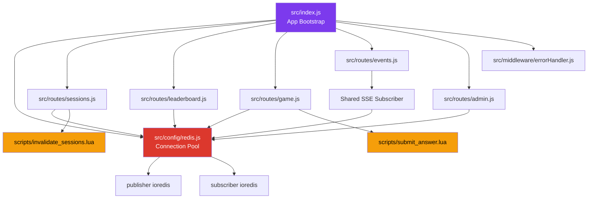
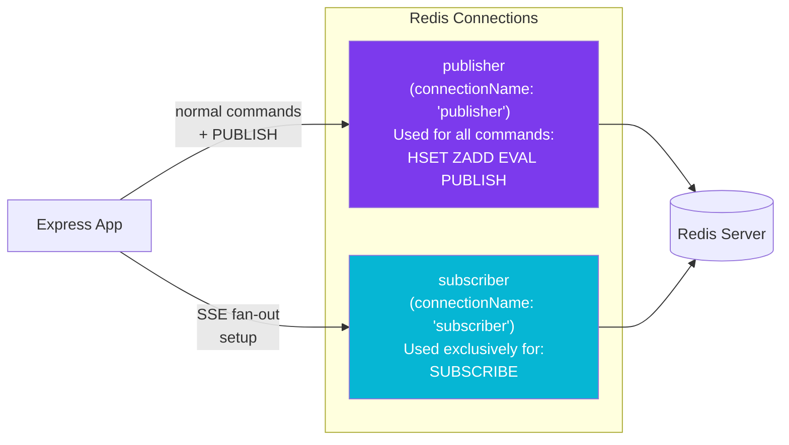
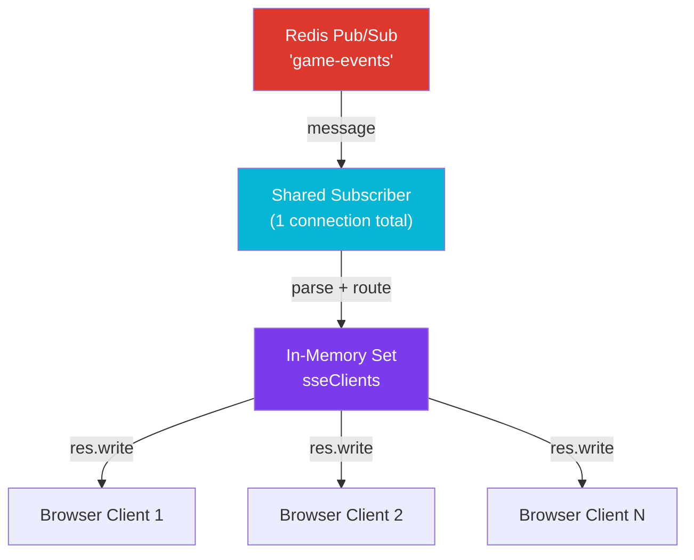
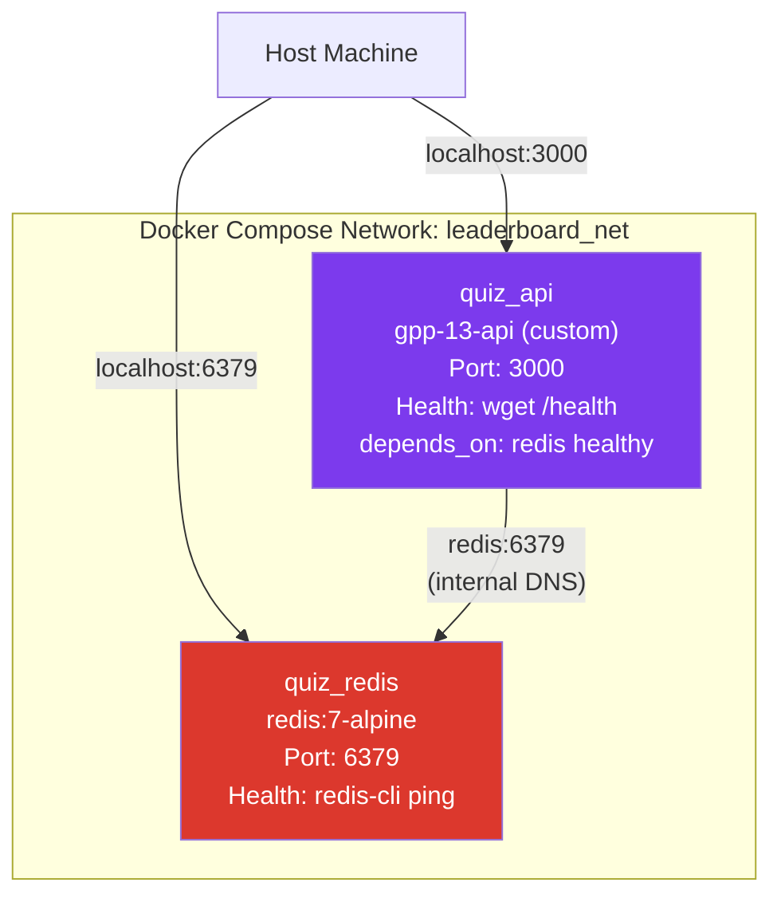
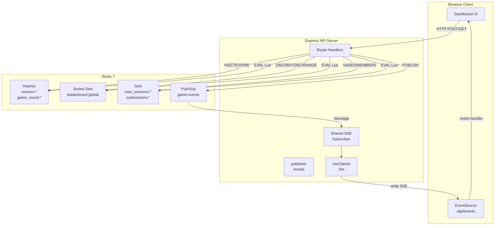

# Architecture Documentation
# QuizArena — Redis-Powered Game Leaderboard

> **Document Version:** 1.0  
> **Project:** AtomicRank / QuizArena  
> **Repository:** https://github.com/ramalokeshreddyp/AtomicRank  
> **Last Updated:** May 2026

---

## Table of Contents

1. [System Overview](#1-system-overview)
2. [Architectural Goals](#2-architectural-goals)
3. [Component Architecture](#3-component-architecture)
4. [Redis Data Architecture](#4-redis-data-architecture)
5. [Two-Connection Pattern](#5-two-connection-pattern)
6. [Atomic Operations Architecture](#6-atomic-operations-architecture)
7. [Real-Time Pipeline Architecture](#7-real-time-pipeline-architecture)
8. [Docker Infrastructure](#8-docker-infrastructure)
9. [API Layer Design](#9-api-layer-design)
10. [Frontend Architecture](#10-frontend-architecture)
11. [Data Flow Diagrams](#11-data-flow-diagrams)
12. [Security Architecture](#12-security-architecture)
13. [Scalability Considerations](#13-scalability-considerations)
14. [Trade-offs and Design Decisions](#14-trade-offs-and-design-decisions)

---

## 1. System Overview

QuizArena is a **multi-tier, event-driven backend** for a real-time competitive quiz game. It demonstrates how Redis can serve as far more than a cache — acting as:

- A **session store** (Hashes with TTL)
- A **real-time leaderboard** (Sorted Sets)
- An **atomic transaction engine** (Lua scripting)
- A **message bus** (Pub/Sub)

```
┌─────────────────────────────────────────────────────────────────┐
│                         SYSTEM BOUNDARY                         │
│                                                                 │
│   ┌──────────────┐    HTTP/SSE    ┌──────────────────────────┐  │
│   │   Browser    │◄──────────────►│    Express.js API Server │  │
│   │  Dashboard   │                │                          │  │
│   └──────────────┘                │  ┌──────────┐            │  │
│                                   │  │ publisher│──── HSET   │  │
│                                   │  │ (ioredis)│──── ZADD   │  │
│                                   │  │          │──── EVAL   │  │
│                                   │  │          │──── PUBLISH│  │
│                                   │  └──────────┘     │      │  │
│                                   │                   │      │  │
│                                   │  ┌──────────┐     │      │  │
│                                   │  │subscriber│◄────┘      │  │
│                                   │  │ (ioredis)│            │  │
│                                   │  └────┬─────┘            │  │
│                                   │       │ fan-out           │  │
│                                   │  SSE clients set         │  │
│                                   └──────────────────────────┘  │
│                                              │                   │
│                                   ┌──────────▼──────────┐       │
│                                   │      Redis 7         │       │
│                                   │  ┌─────────────────┐ │       │
│                                   │  │ Hashes          │ │       │
│                                   │  │ Sorted Sets     │ │       │
│                                   │  │ Sets            │ │       │
│                                   │  │ Pub/Sub         │ │       │
│                                   │  └─────────────────┘ │       │
│                                   └─────────────────────┘       │
└─────────────────────────────────────────────────────────────────┘
```

---

## 2. Architectural Goals

| Goal | Mechanism |
|---|---|
| **Sub-millisecond leaderboard reads** | Redis Sorted Sets in memory |
| **Zero race conditions** | Lua script atomicity via EVAL |
| **Live score propagation < 2 seconds** | Redis Pub/Sub → SSE pipeline |
| **Horizontal API scalability** | Stateless Express + shared Redis |
| **Reproducible deployment** | Docker Compose single-command |
| **Memory efficiency** | ziplist encoding for small structures |

---

## 3. Component Architecture

### 3.1 Component Dependency Graph



### 3.2 Module Responsibilities

| Module | Responsibility | Redis Commands |
|---|---|---|
| `config/redis.js` | Creates and exports publisher + subscriber | `connect()` |
| `routes/sessions.js` | Session lifecycle management | `EVAL`, `HSET`, `EXPIRE`, `SADD` |
| `routes/leaderboard.js` | Score updates + ranked queries | `ZINCRBY`, `ZREVRANGE`, `ZREVRANK`, `ZSCORE`, `ZCARD`, `PUBLISH` |
| `routes/game.js` | Atomic answer processing | `EVAL`, `HSET` |
| `routes/events.js` | SSE fan-out from Pub/Sub | `SUBSCRIBE` |
| `routes/admin.js` | Session inspection and revocation | `SMEMBERS`, `HGETALL`, `HGET`, `DEL`, `SREM` |
| `middleware/errorHandler.js` | Centralized error formatting | — |

---

## 4. Redis Data Architecture

### 4.1 Hash — `session:{sessionId}`

```
Key:   session:550e8400-e29b-41d4-a716-446655440000
Type:  Hash
TTL:   1800 seconds (sliding)

Fields:
  userId      → "user-42"
  createdAt   → "2026-05-05T10:00:00.000Z"
  lastActive  → "2026-05-05T10:15:00.000Z"
  ipAddress   → "192.168.1.1"
  deviceType  → "desktop"

Encoding: ziplist (< 128 fields, values < 64 bytes)
Memory:   ~280 bytes per session
```

### 4.2 Set — `user_sessions:{userId}`

```
Key:   user_sessions:user-42
Type:  Set
TTL:   None (managed manually via Lua)

Members:
  "550e8400-e29b-41d4-a716-446655440000"

Encoding: listpack (< 128 members, values < 64 bytes)
Purpose:  O(1) lookup of all sessions for a user
```

### 4.3 Sorted Set — `leaderboard:global`

```
Key:   leaderboard:global
Type:  Sorted Set
TTL:   None (persistent)

Members (score → member):
  1000 → "player-alpha"
   980 → "player-beta"
   950 → "player-gamma"
   ...

Encoding: ziplist (< 128 members) or skiplist (> 128 members)
Complexity:
  ZINCRBY   → O(log N)
  ZREVRANK  → O(log N)
  ZREVRANGE → O(log N + M) where M = returned count
```

### 4.4 Sorted Set Operations Complexity

```
Operation          | Complexity | Use case
-------------------+------------+---------------------------
ZADD               | O(log N)   | Add player to leaderboard
ZINCRBY            | O(log N)   | Atomic score increment
ZREVRANK           | O(log N)   | Player's rank (0-indexed)
ZREVRANGE          | O(log N+M) | Top N players
ZSCORE             | O(1)       | Player's current score
ZCARD              | O(1)       | Total players (for percentile)
```

### 4.5 Key Schema Summary

```
Namespace         Redis Type    Key Pattern                       TTL
─────────────────────────────────────────────────────────────────────
session           Hash          session:{uuid}                    1800s
user index        Set           user_sessions:{userId}            None
global lb         Sorted Set    leaderboard:global                None
game lb           Sorted Set    leaderboard:game:{gameId}         None
game round        Hash          game_round:{gameId}:{roundId}     3600s
submissions       Set           submissions:{gameId}:{roundId}    Inherits
```

---

## 5. Two-Connection Pattern

### Why Two Connections?

Redis Pub/Sub operates differently from standard command mode:

```
Normal mode:  Client sends commands → Server responds
              SET key value → OK
              GET key → "value"

Pub/Sub mode: Once SUBSCRIBE is called, the connection is LOCKED.
              Only SUBSCRIBE, UNSUBSCRIBE, PSUBSCRIBE, PUNSUBSCRIBE, PING
              are allowed. Regular commands (HSET, ZADD) will error.
```

### Architecture Decision



### Connection Lifecycle

```javascript
// Both connections use lazyConnect: true
// They are explicitly connected on server startup:
await Promise.all([publisher.connect(), subscriber.connect()]);

// Server only accepts traffic after both are ready
app.listen(PORT, ...);
```

---

## 6. Atomic Operations Architecture

### 6.1 The TOCTOU Problem

**Time-of-Check to Time-of-Use** is a classic race condition in multi-step operations:

```
Step 1 (check):  Is player already submitted?  → No
                                                    ← Another request sneaks in here
Step 2 (use):    Record submission              → Records AGAIN → BUG
```

### 6.2 Lua Script Execution Model

```
Client sends: EVAL script numkeys key1 key2 ... arg1 arg2 ...
                              │
                              ▼
               Redis Event Loop (single-threaded)
                              │
                    ┌─────────▼──────────┐
                    │  Lua VM executes   │
                    │  script atomically │
                    │                   │
                    │  redis.call(...)   │──► Direct Redis call
                    │  redis.call(...)   │──► No network round-trip
                    │  redis.call(...)   │──► No interleaving possible
                    └─────────┬──────────┘
                              │
                    Returns result to client
```

### 6.3 Lua Script: `invalidate_sessions.lua`

```
Input:  KEYS[1] = user_sessions:{userId}
Output: count of sessions deleted

Flow:
  1. SMEMBERS KEYS[1]          → get all active session IDs
  2. For each ID:
     DEL session:{id}           → remove session hash
  3. DEL KEYS[1]               → clear the index set
  4. Return count

Atomicity guarantee:
  No concurrent login can observe an intermediate state.
  Either ALL old sessions are gone, or NONE are touched.
```

### 6.4 Lua Script: `submit_answer.lua`

```
Input:
  KEYS[1] = game_round:{gameId}:{roundId}
  KEYS[2] = submissions:{gameId}:{roundId}
  KEYS[3] = leaderboard:global
  ARGV[1] = playerId
  ARGV[2] = answer
  ARGV[3] = currentTimeMs
  ARGV[4] = pointsForCorrect

Output: [statusCode, payload]
  [0,  "newScore"]            → SUCCESS
  [-1, "ROUND_EXPIRED"]       → round window closed
  [-2, "DUPLICATE_SUBMISSION"]→ already answered
  [-3, "ROUND_NOT_FOUND"]     → round doesn't exist

6 Redis operations in one atomic block:
  1. HGET endTime
  2. (conditional) SISMEMBER
  3. SADD (record submission)
  4. HGET correctAnswer
  5. ZINCRBY or ZSCORE
  6. Return
```

---

## 7. Real-Time Pipeline Architecture

### 7.1 Event Flow

```
Score Update Request
        │
        ▼
Express Route Handler
        │
        ├──── ZINCRBY leaderboard:global
        │
        ├──── PUBLISH game-events {event, data}
        │
        └──── Return HTTP response to caller

Redis Pub/Sub Channel: "game-events"
        │
        ▼
Shared SSE Subscriber (1 Redis connection)
        │
        ├──── Parses JSON message
        │
        └──── Iterates sseClients Set
              │
              ├──── res.write(ssePayload) → Browser Tab 1
              ├──── res.write(ssePayload) → Browser Tab 2
              └──── res.write(ssePayload) → Browser Tab N
```

### 7.2 SSE Protocol Format

```
HTTP/1.1 200 OK
Content-Type: text/event-stream
Cache-Control: no-cache
Connection: keep-alive

event: connected
data: {"message":"SSE stream connected","timestamp":"..."}

event: leaderboard_updated
data: {"playerId":"player-alpha","newScore":75}

: heartbeat

event: score_updated
data: {"playerId":"player-alpha","newScore":85,"gameId":"g1","roundId":"r1"}
```

### 7.3 Fan-Out Pattern



**Efficiency:** N browser clients require exactly 1 Redis connection (not N).

---

## 8. Docker Infrastructure

### 8.1 Service Topology



### 8.2 Dockerfile Strategy (Multi-Stage)

```
Stage 1: builder (node:20-alpine)
  ├── COPY package.json
  └── RUN npm install --omit=dev
      (Only production dependencies, no devDependencies)

Stage 2: production (node:20-alpine)
  ├── RUN apk add wget          (for health check)
  ├── COPY from builder/node_modules
  ├── COPY src/ public/
  ├── RUN addgroup/adduser      (non-root security)
  └── CMD node src/index.js
```

**Result:** Small image (~180MB), no build tools in production, runs as non-root.

### 8.3 Health Check Sequence

```
docker-compose up
    │
    ├── quiz_redis starts
    │       │
    │       └── healthcheck: redis-cli ping
    │               │
    │               ▼ HEALTHY (within 10s)
    │
    └── quiz_api starts (depends_on redis: healthy)
            │
            └── healthcheck: wget -qO- http://localhost:3000/health
                    │
                    ▼ HEALTHY (within 20s)
                    │
                    └── All services ready ✅
```

---

## 9. API Layer Design

### 9.1 Request Lifecycle

```
HTTP Request
    │
    ▼
cors() middleware          ← CORS headers
    │
express.json()             ← Parse JSON body
    │
Route Handler
    │
    ├── Input Validation   ← Check required fields
    │
    ├── Redis Operation    ← publisher.* or EVAL
    │
    ├── (optional) PUBLISH ← Trigger SSE fans
    │
    └── res.status().json()
            │
            ▼ (on error)
    next(err) → errorHandler middleware
```

### 9.2 Error Response Format

```json
{
  "error": "Human readable message",
  "stack": "..." // Only in development mode
}
```

### 9.3 Route Organization

```
/health                          → Index.js (inline)
/api/sessions          POST      → routes/sessions.js
/api/leaderboard/scores   POST   → routes/leaderboard.js
/api/leaderboard/top/:count GET  → routes/leaderboard.js
/api/leaderboard/player/:id GET  → routes/leaderboard.js
/api/game/submit          POST   → routes/game.js
/api/game/rounds          POST   → routes/game.js
/api/events               GET    → routes/events.js
/api/admin/sessions/user/:id GET → routes/admin.js
/api/admin/sessions/:id  DELETE  → routes/admin.js
```

---

## 10. Frontend Architecture

### 10.1 SPA Design

The frontend is a dependency-free single-page application:

```
public/index.html      ← Structure + semantic HTML
public/style.css       ← Design tokens, components, animations
public/app.js          ← Application logic

No build step, no bundler, no framework.
Served as static files by Express.
```

### 10.2 Frontend Data Flow

```mermaid
graph LR
    User["User Action"]
    JS["app.js"]
    API["API Server"]
    SSE["SSE Stream"]
    DOM["DOM Update"]

    User -->|click/submit| JS
    JS -->|fetch()| API
    API -->|JSON response| JS
    JS -->|innerHTML| DOM

    SSE -->|EventSource| JS
    JS -->|update leaderboard| DOM

    style SSE fill:#DC382D,color:white
```

### 10.3 Tab Structure

| Tab | Data Source | Update Method |
|---|---|---|
| 🏆 Leaderboard | `GET /api/leaderboard/top/:n` | SSE auto-refresh + manual |
| 🎮 Game Control | `POST /api/game/*` | On-demand |
| 🔐 Sessions | `GET/POST /api/sessions`, `GET /api/admin/*` | On-demand |
| 📡 Live Events | `GET /api/events` SSE | Push (real-time) |

---

## 11. Data Flow Diagrams

### 11.1 Complete System Data Flow



### 11.2 Memory Model

```
Redis Memory Layout (approximate)

leaderboard:global (100k players, skiplist):
  ┌─────────────────────────────────────────┐
  │ skiplist header                         │
  │ ┌──────────┐ ┌──────────┐ ┌──────────┐  │
  │ │ score    │ │ score    │ │ score    │  │
  │ │ 1000.0   │ │  980.0   │ │  960.0   │  │
  │ │ player-1 │ │ player-2 │ │ player-3 │  │
  │ └──────────┘ └──────────┘ └──────────┘  │
  │ hashtable (for O(1) score lookup)       │
  └─────────────────────────────────────────┘
  ~200 bytes per player × 100k = ~19.4 MB

session:{id} (ziplist, < 128 fields):
  ┌────────────────────────────────────────┐
  │ [len][field1][value1][field2][value2]  │
  │ Sequential, cache-friendly             │
  └────────────────────────────────────────┘
  ~280 bytes per session
```

---

## 12. Security Architecture

| Concern | Mitigation |
|---|---|
| **Process privileges** | Container runs as non-root `appuser` |
| **Secret management** | Secrets in `.env` (gitignored), only `.env.example` committed |
| **Session security** | UUID v4 session IDs (cryptographically random, 122 bits entropy) |
| **Input validation** | All route handlers validate required fields before Redis operations |
| **Error information** | Stack traces only exposed in `NODE_ENV=development` |
| **Network isolation** | API and Redis on a private Docker bridge network |

---

## 13. Scalability Considerations

### Horizontal API Scaling

```
Load Balancer (nginx / AWS ALB)
    │
    ├──► API Instance 1 ──┐
    ├──► API Instance 2 ──┼──► Redis (shared state)
    └──► API Instance N ──┘

Each instance:
  - Stateless (no in-memory session state)
  - Owns its own subscriber for SSE fan-out
  - Publishes to shared Redis Pub/Sub channel

Note: SSE fan-out works per-instance.
For truly cross-instance SSE, use sticky sessions at the LB.
```

### Redis Scalability

```
Current: Single Redis node
  → Suitable for ~100k concurrent users, ~10k ops/sec

Next level: Redis Cluster
  → Leaderboard key on one shard
  → Session keys distributed by userId hash

Further: Redis Sentinel
  → Automatic failover
  → Read replicas for GET /api/leaderboard/top
```

---

## 14. Trade-offs and Design Decisions

| Decision | Alternative Considered | Reason Chosen |
|---|---|---|
| **Node.js** | Python/FastAPI | Better native SSE support, ioredis ecosystem |
| **Single-file Lua** | Redis Transactions (MULTI/EXEC) | MULTI can't use conditional logic; Lua can |
| **Fan-out in-process** | Separate SSE service | Simpler for single-instance; scales with sticky sessions |
| **ZINCRBY** | ZADD NX + GET + ZADD | ZINCRBY is atomic; multi-step would need Lua |
| **No auth middleware** | JWT auth | Out of scope; focus on Redis patterns |
| **Vanilla JS frontend** | React/Vue | No build step, zero dependencies, faster to serve |
| **Alpine base image** | Ubuntu/Debian | ~5MB vs ~120MB; faster pulls and smaller attack surface |
